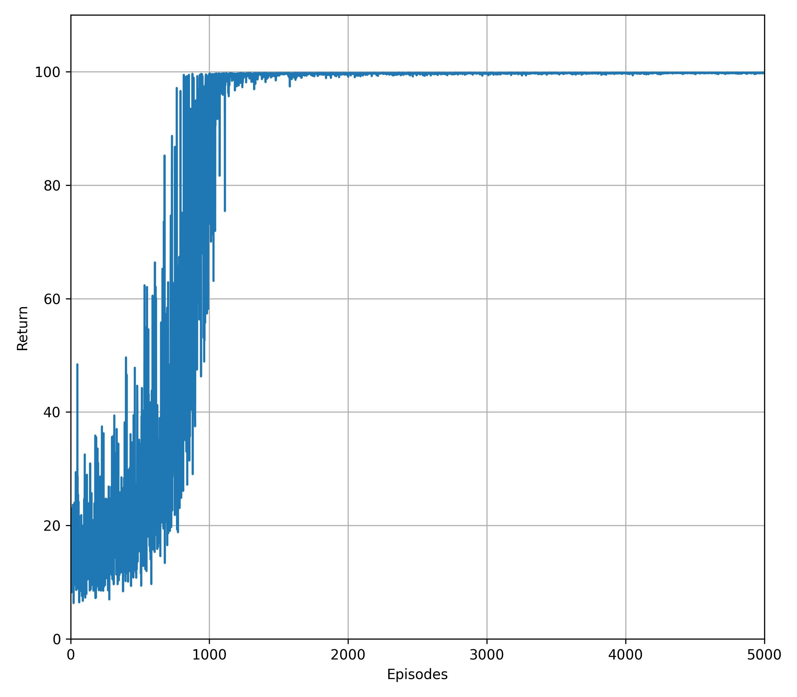

# Actor-Critic Policy Gradient

## Summary
This is a tutorial on how to implement Sutton's actor-critic policy gradients. The main characteristic of this implementation is that the actor uses the temporal difference error instead of the action-value function to update the policy. 

## Results
The algorithm was tested in a modified Pendulum environment. The graph shows the return per episode. 

    

## Dependencies
You'll need a working Python environment to run the code.
The recommended way to set up your environment is through [virtual environments](https://docs.python.org/3/library/venv.html). The required dependencies are specified in the file `requirements.txt`.
